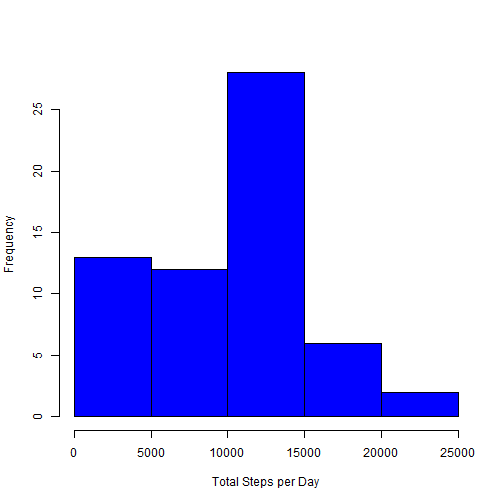
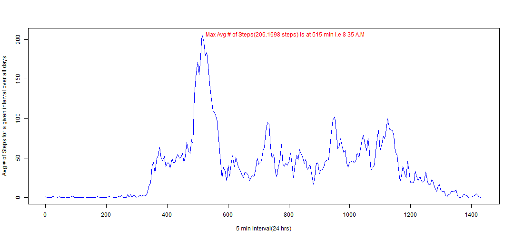
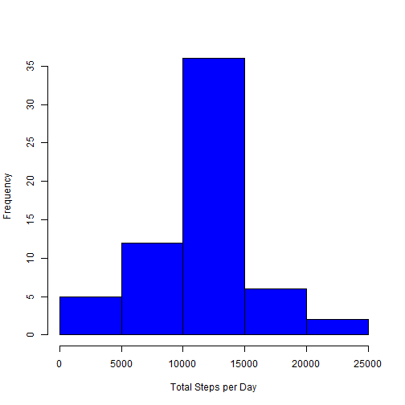
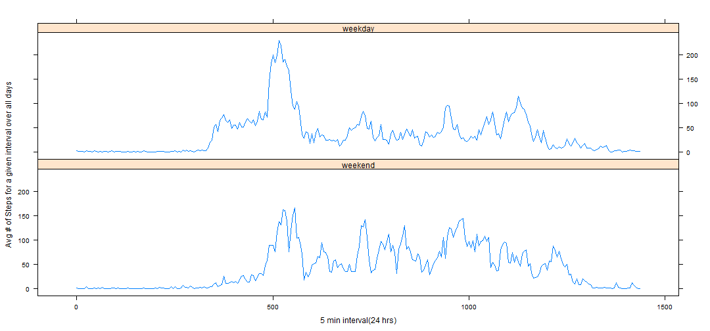

# Reproducible Research: Peer Assessment 1
This assignment makes use of data from a personal activity monitoring device. 
This device collects data at 5 minute intervals through out the day. 
The data consists of two months of data from an anonymous individual collected during the 
months of October and November, 2012 and include the number of steps taken in 5 minute intervals each day.

## Loading and preprocessing the data
### Loading data

*it is assumed that the working directory has the required zipped dataset, the file is unzipped and read using read.csv()*

```r
unzip("activity.zip")
raw_data <- read.csv("activity.csv",header=TRUE,sep=",",stringsAsFactors=F)
```

*The package 'plyr' is used to check the integrity of data, 5 min inerval implies, (60x24)/5 = 288 records per day*

```r
library("plyr")
dat_v <- ddply(raw_data,.(date),nrow)
test <- all(dat_v$V1 == 288)
test
```

```
## [1] TRUE
```

### Preprocessing data(Data Clensing)

*if you look at the record set below, the minute intervals are not continuous after 55 it jumps to 100 and this pattern is followed 
throughout*

```r
raw_data[10:15,]
```

```
##    steps       date interval
## 10    NA 2012-10-01       45
## 11    NA 2012-10-01       50
## 12    NA 2012-10-01       55
## 13    NA 2012-10-01      100
## 14    NA 2012-10-01      105
## 15    NA 2012-10-01      110
```

*The code to follow creates an increment min(incr_min) which overcomes the above discrepency to give the actual min interval*
*Also the data a processed to create a datetime field, which creates a datetime field which gives the actual point in time the activity occured*


```r
days_l <- dat_v[,"date"]
days_l <- sort(days_l)

rec_bfore <- nrow(raw_data)
ctr <- 0

for(d in days_l)
{
  ctr <- ctr + 1
  ext_d <-subset(raw_data,date==d)
#Converting interval into equivalent hour
  int <- ext_d[,"interval"]
  hour_n <- int%/%100
  hour <- as.character(hour_n)
  hour[as.numeric(hour)<10] <- paste0("0",hour[as.numeric(hour)<10])

#Converting interval into equivalent minute
  min_n <- int%%100
  min <- as.character(min_n)
  min[as.numeric(min)<10] <- paste0("0",min[as.numeric(min)<10])
  mrg_d1 <- cbind(ext_d,hour,min,stringsAsFactors=F)
  datetime2 <- paste(mrg_d1$date,mrg_d1$hour,mrg_d1$min)
#Creating datetime field
  datetime <- strptime(datetime2,"%Y-%m-%d %H %M")
    
  mrg_d2 <- cbind(mrg_d1,datetime,hour_n,min_n,stringsAsFactors=F)
  if(ctr == 1)
  { cln_data <- mrg_d2}
  else
  {cln_data <- rbind(cln_data,mrg_d2)}
  }

rec_after <- nrow(cln_data)

#incremental minute field with actual minute
incr_min <- cln_data$hour_n*60+cln_data$min_n
mrg_d3 <- cbind(cln_data,incr_min,stringsAsFactors=F)

#Clean Dataset
cln_data <- mrg_d3[,c(6,2,3,1,4,5,9)]
cln_data[10:15,]
```

```
##               datetime       date interval steps hour min incr_min
## 10 2012-10-01 00:45:00 2012-10-01       45    NA   00  45       45
## 11 2012-10-01 00:50:00 2012-10-01       50    NA   00  50       50
## 12 2012-10-01 00:55:00 2012-10-01       55    NA   00  55       55
## 13 2012-10-01 01:00:00 2012-10-01      100    NA   01  00       60
## 14 2012-10-01 01:05:00 2012-10-01      105    NA   01  05       65
## 15 2012-10-01 01:10:00 2012-10-01      110    NA   01  10       70
```

## What is mean total number of steps taken per day?
*Missing Steps records are ignored*
*Summarizing data in order to meet the requirement*


```r
sum_data <- ddply(cln_data,.(date),summarise,total_steps=sum(steps,na.rm=T),mean_steps=mean(steps,na.rm=T),median_steps=median(steps,na.rm=T))
head(sum_data)
```

```
##         date total_steps mean_steps median_steps
## 1 2012-10-01           0        NaN           NA
## 2 2012-10-02         126     0.4375            0
## 3 2012-10-03       11352    39.4167            0
## 4 2012-10-04       12116    42.0694            0
## 5 2012-10-05       13294    46.1597            0
## 6 2012-10-06       15420    53.5417            0
```
### Histogram of the total number of steps taken each day


```r
hist(sum_data$total_steps,col="blue",main="",xlab="Total Steps per Day")
```

 

### Reporting the mean and median total number of steps taken per day


```r
mean_total <- mean(sum_data[,2])
med_total <- median(sum_data[,2])
```
*Mean of total steps = 9354.2295*
*Median of total steps = 10395*


## What is the average daily activity pattern?
*Missing Steps records are ignored*
*Summarizing data in order to meet the requirement*


```r
sum_data2 <- ddply(cln_data,.(incr_min),summarise,avg_steps=mean(steps,na.rm=T))
head(sum_data2)
```

```
##   incr_min avg_steps
## 1        0   1.71698
## 2        5   0.33962
## 3       10   0.13208
## 4       15   0.15094
## 5       20   0.07547
## 6       25   2.09434
```

### Plotting A time series plot (i.e. type = "l") of the 5-minute interval (x-axis) and the average number of steps taken, averaged across all days (y-axis)
### Which 5-minute interval, on average across all the days in the dataset, contains the maximum number of steps?
*Both the above requirements can be met through a single plot. In the time series plot the interval with max avg steps is found and highligted*

**The avg number of steps is highest in the morning (at 8.35am) this is usually the time people are busy getting to work**

```r
#finding maximum avg steps
max_avg <- max(sum_data2[,"avg_steps"])

#finding record with interval which has max avg steps
max_min <- subset(sum_data2,avg_steps == max_avg)

#assiging the above values to be used as co-ordinates
x_val <- max_min[1,1]
y_val <- max_min[1,2]

#plotting the chart and setting the text highlight the point with max steps
plot(sum_data2$incr_min, sum_data2$avg_steps,type="l",ylab="Avg # of Steps for a given interval over all days",xlab="5 min interval(24 hrs)",col="blue")
text(x_val,y_val,"Max Avg # of Steps(206.1698 steps) is at 515 min i.e 8 35 A.M",col="red",cex=1,pos=4)
```

 


## Inputing missing values

### Calculating the total number of missing values in the dataset (i.e. the total number of rows with NAs)

```r
#Finding number of records with missing steps
no_na <- nrow(subset(cln_data,is.na(steps)==T))
no_na
```

```
## [1] 2304
```
**The total number of missing values in the dataset 2304**

### Strategy for filling in all of the missing values in the dataset.
**The mean for that 5-minute interval will be used to fill in missing values corresponding to the same 5 min interval**

### Creating a new dataset that is equal to the original dataset but with the missing data filled in.
*Below code extracts data for an interval at a time and replaces NA values in it by the mean for the interval which was derived earlier*

```r
#vector with interval list
incrm_l <- sum_data2[,"incr_min"]
incrm_l <- sort(incrm_l)

xtr <- 0
for(i in incrm_l)
{
#replacing NA values for an interval with mean steps for the interval(mean derive by removing NA)
  xtr <- xtr + 1
  extr_d <-subset(cln_data,incr_min==i)
  na_val <- subset(sum_data2,incr_min==i)
  extr_d[is.na(extr_d$steps)==T,4] <- na_val[1,2]
  
  if(xtr == 1)
  { cln_data2 <- extr_d}
  else
  {cln_data2 <- rbind(cln_data2,extr_d)}
}
cln_data2 <- cln_data2[order(cln_data2[,"date"]),]
head(cln_data2)
```

```
##              datetime       date interval   steps hour min incr_min
## 1 2012-10-01 00:00:00 2012-10-01        0 1.71698   00  00        0
## 2 2012-10-01 00:05:00 2012-10-01        5 0.33962   00  05        5
## 3 2012-10-01 00:10:00 2012-10-01       10 0.13208   00  10       10
## 4 2012-10-01 00:15:00 2012-10-01       15 0.15094   00  15       15
## 5 2012-10-01 00:20:00 2012-10-01       20 0.07547   00  20       20
## 6 2012-10-01 00:25:00 2012-10-01       25 2.09434   00  25       25
```

```r
#Check if all NA are replaced. FALSE returned implies , yes.
na_check <- any(is.na(cln_data2[,"steps"]))
na_check
```

```
## [1] FALSE
```

### Histogram of the total number of steps taken each day 

*Summarizing data in order to meet the requirement*

```r
sum_data3 <- ddply(cln_data2,.(date),summarise,total_steps=sum(steps),mean_steps=mean(steps),median_steps=median(steps))
```

### Histogram of the total number of steps taken each day

```r
hist(sum_data3$total_steps,col="blue",main="",xlab="Total Steps per Day")
```

 

###  The mean and median total number of steps taken per day


```r
mean_total2 <- mean(sum_data3[,2])
med_total2 <- median(sum_data3[,2])
```
*Mean of total steps afer replacing NA= 1.0766 &times; 10<sup>4</sup> , before 9354.2295*
*Median of total steps afer replacing NA = 1.0766 &times; 10<sup>4</sup>, before 10395*

**It is clear by substituting NA, the mean and median have increased. The records which were previously ignored , now have values thefore contributing towards the mean, median**

## Are there differences in activity patterns between weekdays and weekends?

### Creating new factor variable in the dataset with two levels – “weekday” and “weekend” indicating whether a given date is a weekday or weekend day.


```r
#translating dates to days(name)
wkday <- weekdays(cln_data2$datetime)
cln_data3 <- cbind(cln_data2,wkday,stringsAsFactors=F)

#Creating weekend factor
cln_data_wend <- subset(cln_data3,wkday == "Saturday" | wkday == "Sunday")
cln_data_wend2 <- cbind(cln_data_wend,day_type=rep("weekend"))

#Creating weekday factor
cln_data_wday <- subset(cln_data3,wkday != "Saturday" & wkday != "Sunday")
cln_data_wday2 <- cbind(cln_data_wday,day_type=rep("weekday"))

#Merging dataset together
cln_data3 <- rbind(cln_data_wend2,cln_data_wday2)
head(cln_data3)
```

```
##                 datetime       date interval steps hour min incr_min
## 1441 2012-10-06 00:00:00 2012-10-06        0     0   00  00        0
## 1442 2012-10-06 00:05:00 2012-10-06        5     0   00  05        5
## 1443 2012-10-06 00:10:00 2012-10-06       10     0   00  10       10
## 1444 2012-10-06 00:15:00 2012-10-06       15     0   00  15       15
## 1445 2012-10-06 00:20:00 2012-10-06       20     0   00  20       20
## 1446 2012-10-06 00:25:00 2012-10-06       25     0   00  25       25
##         wkday day_type
## 1441 Saturday  weekend
## 1442 Saturday  weekend
## 1443 Saturday  weekend
## 1444 Saturday  weekend
## 1445 Saturday  weekend
## 1446 Saturday  weekend
```

### A panel plot containing a time series plot (i.e. type = "l") of the 5-minute interval (x-axis) and the average number of steps taken, averaged across all weekday days or weekend days (y-axis)

*Summarizing data in order to meet the requirement*

```r
sum_data4 <- ddply(cln_data3,.(day_type,incr_min),summarise,avg_steps=mean(steps))
```


```r
library("lattice")
xyplot(sum_data4$avg_steps ~ sum_data4$incr_min | sum_data4$day_type,layout=c(1,2),type="l",xlab="5 min interval(24 hrs)",ylab="Avg # of Steps for a given interval over all days")
```

 

**It was observed that avg steps during weekends is uniformly distributed, this may be attributed to people being involved in chores,shopping etc.
Whereas during weekdays all though there is high avg at the beginging of the day (may be due to commute to work), during the day
the avg steps is pretty low, this may be attributed to most people having office jobs, which involves a lot of sitting.**

